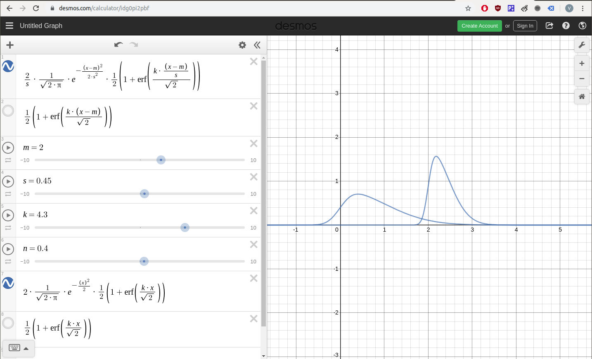

# Novel Machine Learning Research Ideas
- Normalization equation (with parameters mean, stddev, skew, and kurtosis) regression learning, using the equation I've experimented with [here](https://github.com/vicb1/python-reference/blob/master/code/statistics/bell_curve_formula.ipynb).  The ML steps would be the following:
    1. For each feature do a normal fit of the data to find paramters mean, stdev, skew, and kurtosis (m1, st1, sk1, k1; m2, st2, etc. for each feature)
    1. For each feature run a regression fit using the normal curve equation for each feature, initializing the values at the normal fit parameters found in the previous step, and multiplying each paramter by the varying a1, a2, a3, and a4 constant, repeating this for each feature a, b, etc.
    1. The output will be the mean, stdev, skew, and kurtosis parameter constants (a1, a2, a3, a4, b1, b2, etc.) in front of the normal equation for each feature, calibrated to fit the output y value
    1. Benefits:
        - In practice, if enough data is provided, per the Central Limit Theorem, this method should be more accurate than any other polynomial equation for regression learning
- Decision tree that chooses based on non-traditional functions like modulus instead of just greater/less than decision method
- KNN that creates a polynomial distance function to test distance between points, instead of euclidian/manhattan/etc distance 
- KNN that weighs the importance of different features, because normally all features are weighted equally 
- Locally weighted regression - could run linear regression, neural network, etc. on a neighborhood of KNN points, and repeat for each neighborhood  
- Naïve Bayes Learner where it can map dependent variables with a confidence on how dependent they are
- Naïve bayes with weights for different features, so it can minimze issues with double counting potentially dependent attributes 
- Neural networks with different optimizers for back-propagation, possibly taking advantage of discrete optimizers instead of continuous gradient descent optimizers
- Use the powerful deep learning sequence model, Bidirectional Recurrent Neural Network (BRNN) with Long Short-Term Memory (LSTM) nodes or Gated Recurrent Unit (GRU) nodes for robotic planning applications
    - Compare this with deep reinforcement learning models
- Have multiple agents interacting together by either expanding outputs of one neural network or using multiple feedback connections between agents.  
- If any algorithm is promising, simulate in ROS with Gazebo, such as these deep reinforcement learning examples:
    - https://github.com/AcutronicRobotics/gym-gazebo2
        - https://github.com/AcutronicRobotics/ros2_documentation
        - https://github.com/erlerobot/gym-gazebo
    - https://rds.theconstructsim.com/r/theconstruct/cartpole3d_openai_ros_deepq/
- If any ROS simulations are successful, convert ROS to real time system on Raspberry Pi
    - https://roscon.ros.org/2015/presentations/RealtimeROS2.pdf
    - https://design.ros2.org/articles/realtime_background.html
    - https://www.youtube.com/watch?v=iLiI_IRedhI

## Bell curve formula, supporting Normalization equation regression idea above

Bell curve formula equation and parameter interaction:
- graph: https://www.desmos.com/calculator/idg0pi2pbf
- TODO: add kurtosis

- with mean, sigma, skew:
    - \frac{2}{s}\cdot\frac{1}{\sqrt{2\cdot\pi}}\cdot e^{-\frac{\left(x-m\right)^2}{2\cdot s^2}}\cdot\frac{1}{2}\left(1+\operatorname{erf}\left(\frac{k\cdot\frac{\left(x-m\right)}{s}}{\sqrt{2}}\right)\right)
- with skew only:
    - 2\cdot\frac{1}{\sqrt{2\cdot\pi}}\cdot e^{-\frac{\left(x\right)^2}{2}}\cdot\frac{1}{2}\left(1+\operatorname{erf}\left(\frac{k\cdot x}{\sqrt{2}}\right)\right)

### References:
- https://en.wikipedia.org/wiki/Skew_normal_distribution
- https://www.thoughtco.com/normal-distribution-bell-curve-formula-3126278
- https://www.originlab.com/doc/Origin-Help/Gaussian-Function-FitFunc
- https://math.stackexchange.com/questions/1128781/whats-the-formula-for-the-probability-density-function-of-skewed-normal-distribu
- https://en.wikipedia.org/wiki/Skew_normal_distribution
