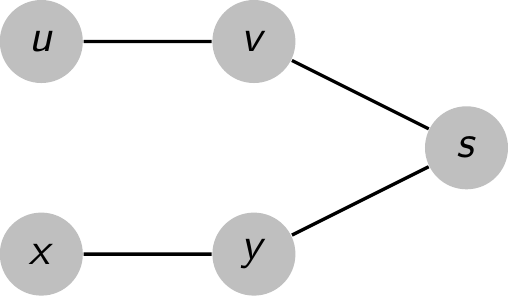
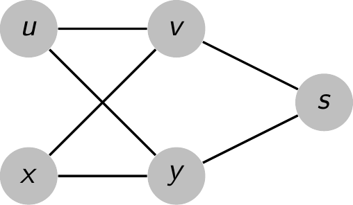

## 22.2-1

> Show the $d$ and $\pi$ values that result from running breadth-first search on the directed graph of Figure 22.2(a), using vertex $3$ as the source.

$$
\begin{array}{c|cccccc}
\text{vertex} & 1 & 2 & 3 & 4 & 5 & 6 \\\\
\hline
d & \infty & 3 & 0 & 2 & 1 & 1 \\\\
\pi & \text{NIL} & 4 & \text{NIL} & 5 & 3 & 3
\end{array}
$$

## 22.2-2

> Show the $d$ and $\pi$ values that result from running breadth-first search on the undirected graph of Figure 22.3, using vertex $u$ as the source.

$$
\begin{array}{c|cccccc}
\text{vertex} & r & s & t & u & v & w & x & y \\\\
\hline
d & 4 & 3 & 1 & 0 & 5 & 2 & 1 & 1 \\\\
\pi & s & w & u & \text{NIL} & r & t & u & u
\end{array}
$$

## 22.2-3

> Show that using a single bit to store each vertex color suffices by arguing that the $\text{BFS}$ procedure would produce the same result if lines 5 and 14 were removed.

The textbook introduces the $\text{GRAY}$ color for the pedagogical purpose to distinguish between the $\text{GRAY}$ nodes (which are enqueued) and the $\text{BLACK}$ nodes (which are dequeued).

Therefore, it suffices to use a single bit to store each vertex color. 

## 22.2-4

> What is the running time of $\text{BFS}$ if we represent its input graph by an adjacency matrix and modify the algorithm to handle this form of input?

The time of iterating all edges becomes $O(V^2)$ from $O(E)$. Therefore, the running time is $O(V + V^2)$.

## 22.2-5

> Argue that in a breadth-first search, the value $u.d$ assigned to a vertex $u$ is independent of the order in which the vertices appear in each adjacency list. Using Figure 22.3 as an example, show that the breadth-first tree computed by $\text{BFS}$ can depend on the ordering within adjacency lists.

First, we will show that the value $d$ assigned to a vertex is independent of the order that entries appear in adjacency lists. To do this, we rely on theorem 22.5, which proves correctness of BFS. In particular, that we have $v.d = \delta(s, v)$ at the end of the procedure. Since $\delta(s, v)$ is a property of the underlying graph, no matter which representation of the graph in terms of adjacency lists that we choose, this value will not change. Since the $d$ values are equal to this thing that doesn't change when we mess with the adjacency lists, it too doesn't change when we mess with the adjacency lists.

Now, to show that $\pi$ does depend on the ordering of the adjacency lists, we will be using Figure 22.3 as a guide.

First, we note that in the given worked out procedure, we have that in the adjacency list for $w$, $t$ precedes $x$. Also, in the worked out procedure, we have that $u.\pi = t$.

Now, suppose instead that we had $x$ preceding $t$ in the adjacency list of $w$. Then, it would get added to the queue before $t$, which means that it would $u$ as it's child before we have a chance to process the children of $t$. This will mean that $u.\pi = x$ in this different ordering of the adjacency list for $w$.

## 22.2-6

> Give an example of a directed graph $G = (V, E)$, a source vertex $s \in V$, and a set of tree edges $E_\pi \subseteq E$ such that for each vertex $v \in V$, the unique simple path in the graph $(V, E_\pi)$ from $s$ to $v$ is a shortest path in $G$, yet the set of edges $E_\pi$ cannot be produced by running $\text{BFS}$ on $G$, no matter how the vertices are ordered in each adjacency list.

Let $G$ be the graph shown in the first picture, $G_\pi = (V, E_\pi)$ be the graph shown in the second picture, and $s$ be the source vertex.

We could see that $E_\pi$ will never be produced by running BFS on $G$.

<center>


</center>

- If $y$ precedes $v$ in the $Adj[s]$. We'll dequeue $y$ before $v$, so $u.\pi$ and $x.\pi$ are both $y$. However, this is not the case.
- If $v$ preceded $y$ in the $Adj[s]$. We'll dequeue $v$ before $y$, so $u.\pi$ and $x.\pi$ are both $v$, which again isn't true.

Nonetheless, the unique simple path in $G_\pi$ from $s$ to any vertex is a shortest path in $G$.

## 22.2-7

> There are two types of professional wrestlers: "babyfaces" ("good guys") and "heels" ("bad guys"). Between any pair of professional wrestlers, there may or may not be a rivalry. Suppose we have $n$ professional wrestlers and we have a list of $r$ pairs of wrestlers for which there are rivalries. Give an $O(n + r)$-time algorithm that determines whether it is possible to designate some of the wrestlers as babyfaces and the remainder as heels such that each rivalry is between a babyface and a heel. If it is possible to perform such a designation, your algorithm should produce it.

This problem is basically just a obfuscated version of two coloring. We will try to color the vertices of this graph of rivalries by two colors, "babyface" and "heel". To have that no two babyfaces and no two heels have a rivalry is the same as saying that the coloring is proper. To two color, we perform a breadth first search of each connected component to get the $d$ values for each vertex. Then, we give all the odd ones one color say "heel", and all the even d values a different color. We know that no other coloring will succeed where this one fails since if we gave any other coloring, we would have that a vertex $v$ has the same color as $v.\pi$ since $v$ and $v.\pi$ must have different parities for their $d$ values. Since we know that there is no better coloring, we just need to check each edge to see if this coloring is valid. If each edge works, it is possible to find a designation, if a single edge fails, then it is not possible. Since the BFS took time $O(n + r)$ and the checking took time $O(r)$, the total runtime is $O(n + r)$.

## 22.2-8 $\star$

> The **_diameter_** of a tree $T = (V, E)$ is defined as $\max_{u,v \in V} \delta(u, v)$, that is, the largest of all shortest-path distances in the tree. Give an efficient algorithm to compute the diameter of a tree, and analyze the running time of your algorithm.

Suppose that a and b are the endpoints of the path in the tree which achieve the diameter, and without loss of generality assume that $a$ and $b$ are the unique pair which do so. Let $s$ be any vertex in $T$. We claim that the result of a single $\text{BFS}$ will return either $a$ or $b$ (or both) as the vertex whose distance from $s$ is greatest.

To see this, suppose to the contrary that some other vertex $x$ is shown to be furthest from $s$. (Note that $x$ cannot be on the path from $a$ to $b$, otherwise we could extend). Then we have

$$d(s, a) < d(s, x)$$

and

$$d(s, b) < d(s, x).$$

Let $c$ denote the vertex on the path from $a$ to $b$ which minimizes $d(s, c)$. Since the graph is in fact a tree, we must have

$$d(s, a) = d(s, c) + d(c, a)$$

and

$$d(s, b) = d(s, c) + d(c, b).$$

(If there were another path, we could form a cycle). Using the triangle inequality and inequalities and equalities mentioned above we must have

$$
\begin{aligned}
d(a, b) + 2d(s, c) & = d(s, c) + d(c, b) + d(s, c) + d(c, a) \\\\
                   & < d(s, x) + d(s, c) + d(c, b).
\end{aligned}
$$

I claim that $d(x, b) = d(s, x) + d(s, b)$. If not, then by the triangle inequality we must have a strict less-than. In other words, there is some path from $x$ to $b$ which does not go through $c$. This gives the contradiction, because it implies there is a cycle formed by concatenating these paths. Then we have

$$d(a, b) < d(a, b) + 2d(s, c) < d(x, b).$$

Since it is assumed that $d(a, b)$ is maximal among all pairs, we have a contradiction. Therefore, since trees have $|V| - 1$ edges, we can run $\text{BFS}$ a single time in $O(V)$ to obtain one of the vertices which is the endpoint of the longest simple path contained in the graph. Running $\text{BFS}$ again will show us where the other one is, so we can solve the diameter problem for trees in $O(V)$.

## 22.2-9

> Let $G = (V, E)$ be a connected, undirected graph. Give an $O(V + E)$-time algorithm to compute a path in $G$ that traverses each edge in $E$ exactly once in each direction. Describe how you can find your way out of a maze if you are given a large supply of pennies.

First, the algorithm computes a minimum spanning tree of the graph. Note that this can be done using the procedures of Chapter 23. It can also be done by performing a breadth first search, and restricting to the edges between $v$ and $v.\pi$ for every $v$. To aide in not double counting edges, fix any ordering $\le$ on the vertices before hand. Then, we will construct the sequence of steps by calling $\text{MAKE-PATH}(s)$, where $s$ was the root used for the $\text{BFS}$.

```cpp
MAKE-PATH(u)
    for each v ∈ Adj[u] but not in the tree such that u ≤ v
        go to v and back to u
    for each v ∈ Adj[u] but not equal to u.π
        go to v
        perform the path proscribed by MAKE-PATH(v)
    go to u.π
```
